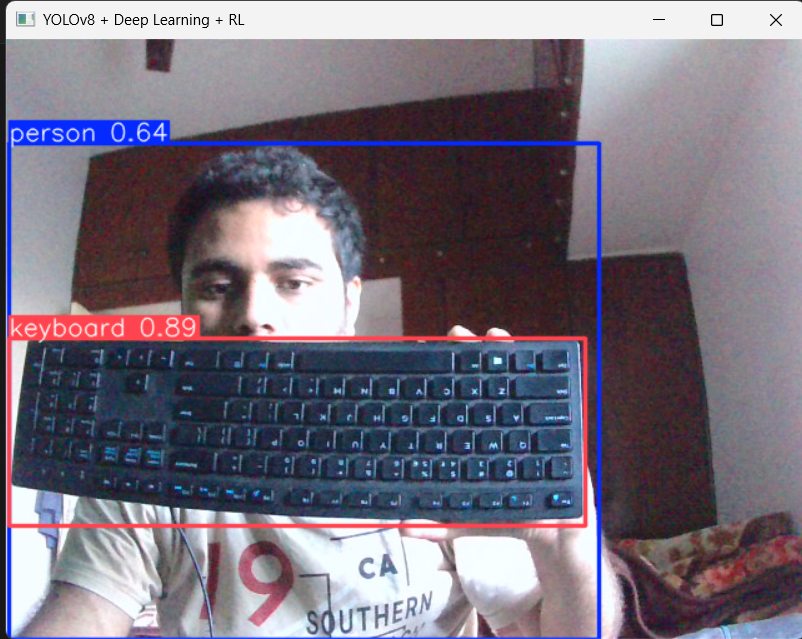
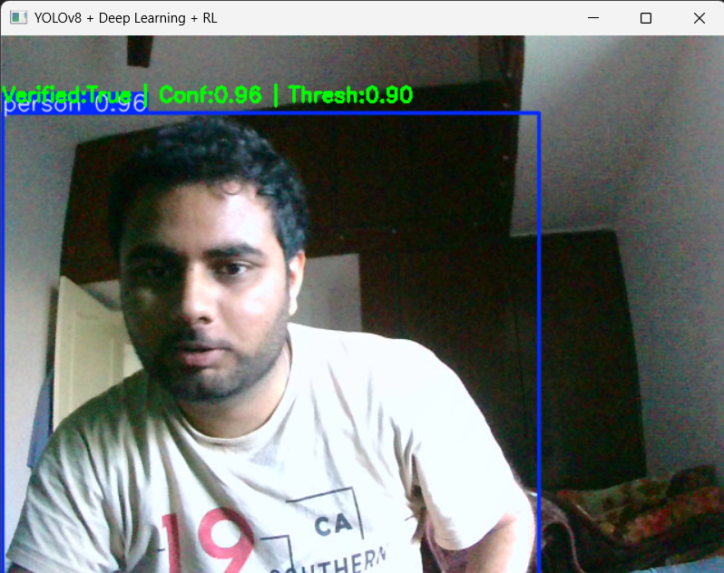
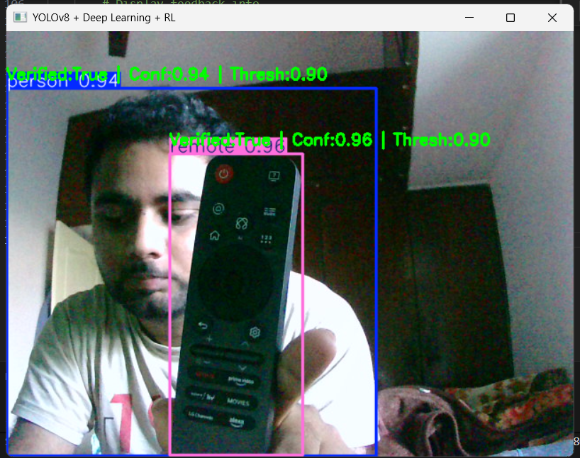
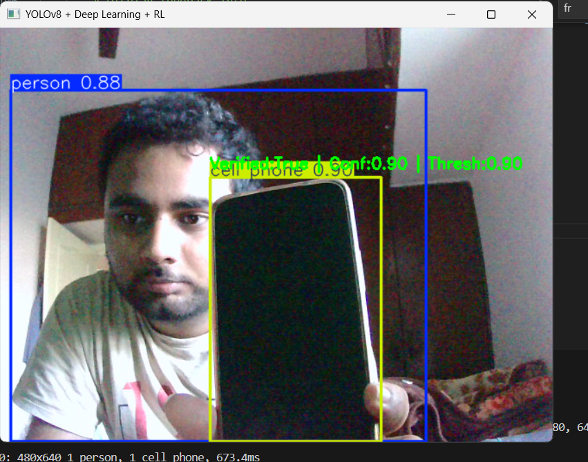

# Real-Time Object Detection (YOLOv8 + OpenCV)

[](https://www.python.org/)
[](LICENSE)
[](https://github.com/ultralytics/ultralytics)

A lightweight, easy-to-run real-time object detection project using Ultralytics YOLOv8 and OpenCV. Captures webcam frames, runs YOLOv8 inference per frame, and displays annotated output with bounding boxes, class labels, and confidence scores.

---

Table of Contents
- [Features](#features)
- [Project Structure](#project-structure)
- [Requirements](#requirements)
- [Installation](#installation)
- [Usage](#usage)
- [Configuration](#configuration)
- [Screenshots](#screenshots)
- [Troubleshooting & Tips](#troubleshooting--tips)
- [Future Improvements](#future-improvements)
- [Contributing](#contributing)
- [License](#license)
- [Author](#author)

---

## Features
- Real-time object detection from webcam
- Uses Ultralytics YOLOv8 pre-trained models (yolov8n.pt, yolov8s.pt, etc.)
- Fast inference with high accuracy
- Annotated frames with bounding boxes, class names, and confidence scores
- Optional hook for a secondary CNN verifier
- Cross-platform: Windows / macOS / Linux

---

## Project Structure
project-folder/
```
├── main.py
├── requirements.txt
├── README.md
├── LICENSE
├── screenshots/
│   ├── output1.png
│   ├── output2.png
│   ├── output3.png
│   └── output4.png
└── models/
    └── yolov8n.pt
```

---

## Requirements
- Python 3.8+
- pip

Recommended Python packages (also available in `requirements.txt`):
- ultralytics
- opencv-python
- numpy
- (optional) tensorflow or torch if using additional verification networks

Example requirements.txt:
```text
ultralytics
opencv-python
numpy
# Optional
tensorflow
```

---

## Installation

1. Clone the repository:
```bash
git clone https://github.com/your-username/your-repository.git
cd your-repository
```

2. Create and activate a virtual environment (recommended):
```bash
python -m venv .venv
# Windows
.venv\Scripts\activate
# macOS / Linux
source .venv/bin/activate
```

3. Install dependencies:
```bash
pip install -r requirements.txt
# If you don't have ultralytics in requirements:
pip install ultralytics opencv-python numpy
```

4. Download or add a YOLOv8 model to the `models/` folder (e.g., `yolov8n.pt`). You can also use the Ultralytics hub models by name.

---

## Usage

Basic usage example (main.py):
```bash
python main.py
```

Sample code (core flow):
```python
from ultralytics import YOLO
import cv2

model = YOLO("models/yolov8n.pt")  # or "yolov8n.pt"

cap = cv2.VideoCapture(0)
while True:
    ret, frame = cap.read()
    if not ret:
        break

    results = model(frame)           # Run inference
    annotated = results[0].plot()    # Annotated frame (numpy array)

    cv2.imshow("YOLOv8 Real-Time Detection", annotated)
    if cv2.waitKey(1) & 0xFF == ord('q'):
        break

cap.release()
cv2.destroyAllWindows()
```

Keyboard controls:
- q : Quit the app
- (Optionally add other keys in your script for saving frames or toggling overlays)

---

## Configuration

- Model: change `models/yolov8n.pt` to any YOLOv8 model (yolov8s.pt / yolov8m.pt / custom.pt).
- Camera: change `cv2.VideoCapture(0)` to another device index or video file.
- Confidence threshold, classes, and other parameters can be configured via `model.predict()` or the Ultralytics API.

GPU:
- Ultralytics automatically uses GPU if available (CUDA + compatible PyTorch). Ensure you have the CUDA-enabled PyTorch installed for best performance.

---

## Screenshots

Examples of annotated outputs (stored in `screenshots/`):

<p align="center">
  
  
</p>

<p align="center">
  
  
</p>

---

## Troubleshooting & Tips
- Camera not opening: try a different device index, e.g., `cv2.VideoCapture(1)`, or check OS permissions.
- Slow inference: use a smaller model (yolov8n) or enable GPU with CUDA.
- Missing model file: ensure `models/yolov8n.pt` exists or change path to a valid model.
- If `ultralytics` can't find dependencies, reinstall with `pip install ultralytics --upgrade`.

---

## Future Improvements
- Custom-trained YOLOv8 model for domain-specific detection
- GUI dashboard with controls (thresholds, model selection)
- Auto-save or video-record detected sessions
- Object counting, tracking, and ROI-based alerts
- Compile demo GIFs and add CI tests

---

## Contributing
Contributions, bug reports, and feature requests are welcome! Please:
1. Open an issue to discuss major changes.
2. Fork the repo and create a branch for changes.
3. Submit a pull request with a clear description of changes.

---

## License
This project is licensed under the MIT License — see the LICENSE file for details.

---

## Author
Ramesh KN
- GitHub: https://github.com/Rameshkn04
- Project: Real-Time Object Detection (YOLOv8 + OpenCV)

---

If you want, I can:
- Add badges (CI, PyPI, stars),
- Add a demo GIF,
- Produce a minimal `main.py` example or a sample `requirements.txt`,
- Create a CONTRIBUTING.md or PR template.

Tell me which additions you'd like and I’ll add them. 
